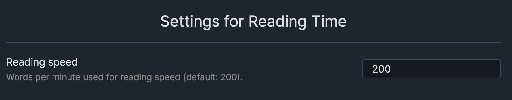

## Obsidian Reading Time Plugin

Simple plugin to add an estimated reading time for the selected note to the StatusBar.

## Compatibility
**Note:** The Obsidian API is still in early alpha and is subject to change at any time!

Custom plugins are only available for Obsidian v0.9.7+.

The current API of this repo targets Obsidian **v0.9.7**.

## How to install the plugin

- Download the [Latest release](https://github.com/avr/obsidian-reading-time/releases/latest)
- Extract the `obsidian-reading-time` folder from the zip to your vault `<vault>/.obsidian/plugins/`